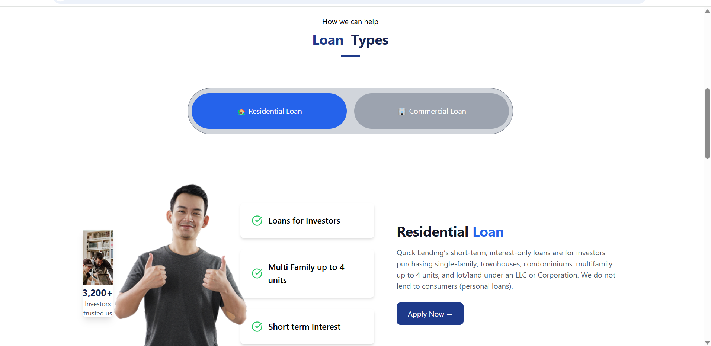
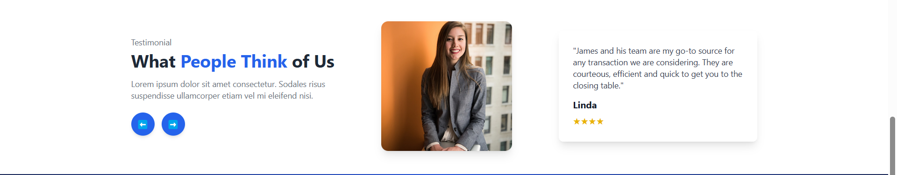
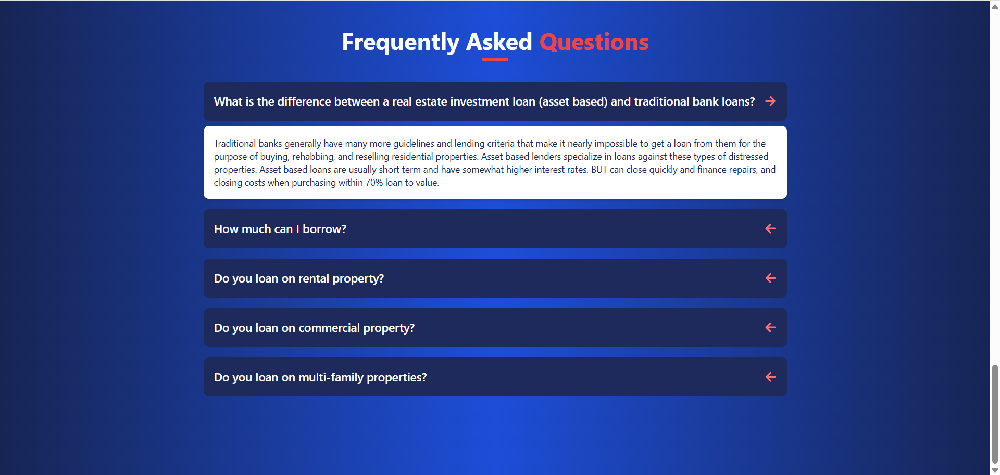

# Assignment Project

Welcome to the **Assignment Project**! This application is designed to provide an intuitive and seamless user experience. Below, you'll find a brief overview of the app, key screenshots, and a guide on how to set up and run the project locally.

## Screenshots
Here are some snapshots of the application:

- 
-  
- 
- 
- 

## Features
- User-friendly interface
- Efficient and responsive design
- Secure authentication and data handling
- Optimized performance

## Getting Started
Follow the steps below to clone and run the project locally.

### Prerequisites
Ensure you have the following installed:
- [Node.js](https://nodejs.org/)
- [Git](https://git-scm.com/)
- A package manager like **npm** or **yarn**

### Installation
1. Clone the repository:
   ```sh
   git clone https://github.com/nikhil6392/assignment.git
   ```

2. Navigate to the project directory:
   ```sh
   cd assignment
   ```

3. Install dependencies:
   ```sh
   npm install
   ```
   or
   ```sh
   yarn install
   ```

4. Start the application:
   ```sh
   npm start
   ```
   or
   ```sh
   yarn start
   ```

### Running in Development Mode
To run the app in development mode, use:
```sh
npm run dev
```
or
```sh
yarn dev
```

### Contributing
Contributions are welcome! Feel free to submit issues or pull requests to improve the project.

### License
This project is licensed under the MIT License.

Copyright

© 2025 nikhil6392. All rights reserved.

---
Thank you For visiting! 🚀

